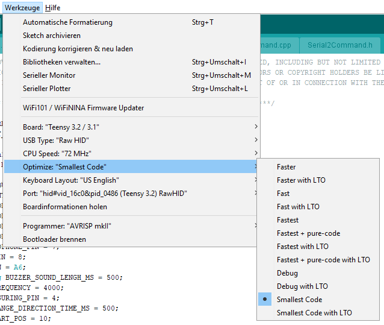

# VRLate
Tool to measure motion-to-photon and mouth-to-ear latency in distributed VR-Systems. For more information have a look at the [paper](https://arxiv.org/abs/1809.06320 "paper") presented at the [15th workshop on VR and AR of the Gesellschaft für Informatik e.V. 2018](https://www.givrar2018.de/).

## Overview
Compared to existing measurement techniques, the described method is specially designed for distributed VR systems. It will help to evaluate different setups in terms of motion-to-photon and mouth-to-ear latencies. The game-engine *Unity 3D* is used to simulate the virtual world. The following two figures demonstrate how the system works. 

  
  

Two distributed measurement systems are synchronized via a GPS timepules. At both stations the motion-to-photon latency and the mouth-to-ear latency is measured via a potentiometer, photodiodes, piezo buzzers, and microphones. For more information please read the [paper](https://arxiv.org/abs/1809.06320 "paper").

## Hardware
The hardware setup of the system is shown in the following picture. All circuits are drawn with the open-source software *Fritzing* and are added to the [Fritzing folder]("/Fritzing/").

### Rotation platform
For the measurement setup, a potentiometer is used to continuously trace the rotation angle of the tracked object (e.g., an HMD). A servo connected to the microcontroller controls the platform rotary motion. With this setup, steady back-and-forth movements of the tracked object are possible.

### Photosensor
The photosensor is used to monitor display outputs and captures the rotary angle of the tracking system which is output in a brightness code. During measurement, right before the rendering process, the VR system outputs the last captured horizontal rotation angle in an encoded brightness code. The *TSL250R photosensors* was used to capture the screen brightness with the microcontroller. 

> Please Note that in the paper we described and used a photosensor with four *TSL250R* diodes. Further tests showed that the system could also be simplified by only using one diode. The Unity code was updated to work with one photodiode reading only.

## Software

To run the project the following software needs to be installed:

- **Arduino 1.8.8** IDE to compile the C++ code to the microcontroller. [link](https://www.arduino.cc/en/Main/OldSoftwareReleases "link")
- **Teensy Loader 1.45** Program used to allow the compilation of teensy code with the Arduino IDE. [link (windows)](https://www.pjrc.com/teensy/td_145/TeensyduinoInstall.exe)
- **Unity 3D 2017.1.1f1** Game engine [link](https://unity3d.com/de/get-unity/download/archive)
- **R** Statistics program [link](https://cran.r-project.org/bin/windows/base/). **RStudio** is recommended as IDE [link](https://www.rstudio.com/).
- **(optional) TTL Driver** Driver for used TTL adapter. Required to be installed manually for Windows 7. [link](https://www.jens-bretschneider.de/aktuelle-treiber-fur-seriell-zu-usb-adapter/)

## Quick Start

The project can be split in three components:

- **ArduinoIno** Contains all the microcontroller code.
- **Unity** Untiy 3D project to output the brightness code, take measurements and write the results to disk.
- **Parser** R script to parse the measurement results and calculate the end-to-end latency of the VR-system.

### Setup 
Both USB-ports of the *Teensy 3.2* bust be connected to the PC. The built-in mini-USB-port is used to program and debug the microcontroller. The other USB to TTL adapter is used to communicate between the Unity instance and the external microcontroller. Before you can start using the hardware you have to compile and upload the C++ code. Start the Arduino IDE and select the *Teensy 3.2* board. Also make sure that the correct USB-interface and Port is selected (see the following screenshots).

Another very important setting that needs to be adjusted is the optimizer. Make sure that the Arduino compiler optimizes for smallest code. See next image for details:

After the controller is powered via the USB-Port, the second USB->TTL adapter should be visible to the windows operating system. Open the device manager and check that a COM port is open. 

Compile and upload the VRLate code via the Arduino IDE. 

### Run 

After the hardware is setup, the teensy microcontroller needs to be connected with the computer running the VR simulation. Within the provided Unity project open the *VRLate* scene. There is only one parent game object (*camera*) which has the VRLate script attached to it. All necessary settings must be set in this script instance.

Please make sure that Unity and teensy are connected correctly and check if the right serial port is set in the *VR Late script* (default is COM4). Run the Unity project and check whether error messages occur. If so, recheck the wiring and make sure that the baud rate is set correctly (default is 250000). 

If no error message occurs, you can start taking measurements. Run the Unity project and hit *F1* to start measurement. If no servo motor is connected to the microcontroller you then have to rotate the HMD mounted on the potentiometer back and forth manually. 

If you have two distributed systems which are synchronized via a valid GPS timestamp, you can press *F2* on both stations and the measurement will start at the next full minute. 

After measurement, Unity outputs CSV files to the designated folder (set output directory in *VRLate script*). The provided [R-script](/Parser/VRLate.r) can then be used to retrieve the motion-to-photon delay via cross-correlation.

## Citation
If you use this project for your research, please consider citing:

    @article{Becher.2018,
         author = {
            Becher, Armin 
            and Angerer, Jens 
            and Grauschopf, Thomas},
         title = {Novel Approach to Measure Motion-To-Photon and Mouth-To-Ear Latency in Distributed Virtual Reality Systems},
         publisher = {Shaker},
         isbn = {978-3-8440-6215-1},
         series = {Berichte aus der Informatik},
         editor = {Herder, Jens and Geiger, Christian and D{\"o}rner, Ralf and Grimm, Paul},
         booktitle = {Virtuelle und Erweiterte Realit{\"a}t},
         year = {2018},
         address = {Herzogenrath}
    }

## License

This project is licensed under the MIT License - see the [LICENSE.md](LICENSE.md) file for details.
