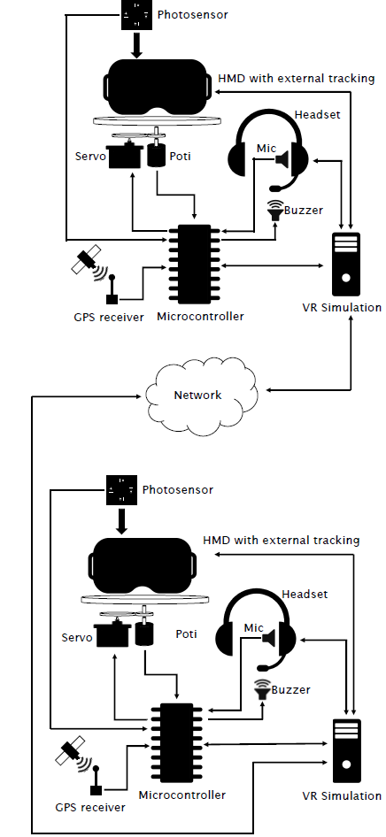
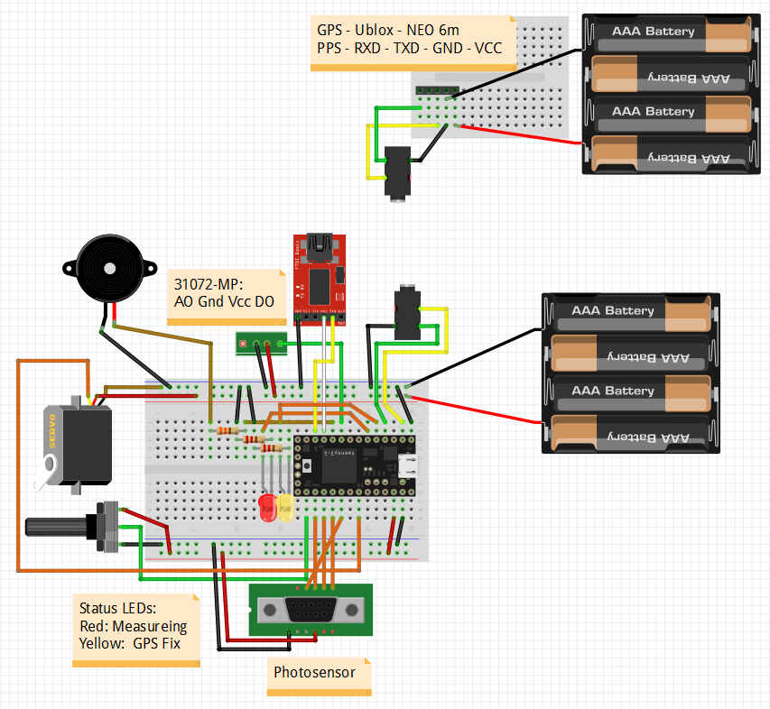
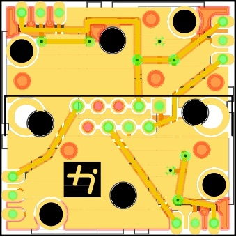
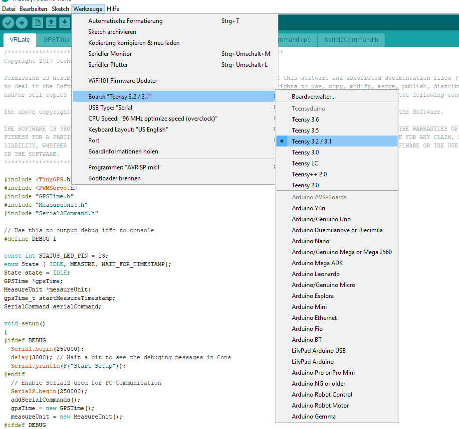
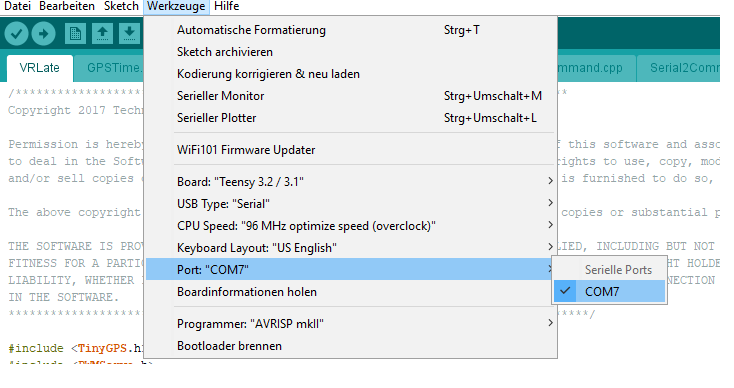
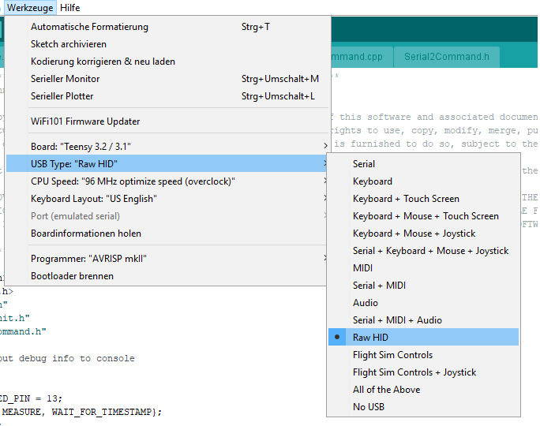
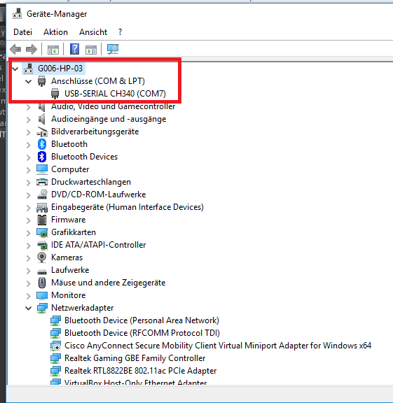

# VRLate
Tool to measure motion-to-photon and mouth-to-ear latency in distributed VR-Systems. For more information have a look at the [paper](https://arxiv.org/abs/1809.06320 "paper") presented at the [15th workshop on VR and AR of the Gesellschaft für Informatik e.V. 2018](https://www.givrar2018.de/).

## Overview
Compared to existing measurement techniques, the described method is specially designed for distributed VR systems. It will help to evaluate different setups in terms of motion-to-photon and mouth-to-ear latencies. The game-engine *Unity 3D* is used to simulate the virtual world. The following two figures demonstrate how the system works. 

  
  

Two distributed measurement systems are synchronized via a GPS timepules. At both stations the motion-to-photon latency and the mouth-to-ear latency is measured via a potentiometer, photodiodes, piezo buzzers, and microphones. For more information please read the [paper](https://arxiv.org/abs/1809.06320 "paper").

## Hardware
The hardware setup of the system is shown in the following picture. All circuits are drawn with the open-source software *Fritzing* and are added to the [Fritzing folder]("/Fritzing/").

### Rotation platform
For the measurement setup, a potentiometer is used to continuously trace the rotation angle of the tracked object (e.g., an HMD). A servo connected to the microcontroller controls the platform rotary motion. With this setup, steady back-and-forth movements of the tracked object are possible.
### Photosensor
The photosensor is used to monitor display outputs and captures the rotary angle of the tracking system which is output in a brightness code. During measurement, right before the rendering process, the VR system outputs the last captured horizontal rotation angle in an encoded brightness code. To get a resolution of 4096 different values, four areas on the display are used to output a number in the octal numeral system. By capturing each area with a light-sensitive sensor connected to the microcontroller, it is possible to get the rotation angle output of the VR system at every interval. The whole photosensor consists of four TSL250R photosensors. 

With the HMDs used in this work, it is not possible to directly attach the photosensor to the VR display without the need to disassemble the hardware. HMDs use optical lenses in front of the display system to expand the field of view. Without any light path correction, it is not possible to get a sharp image of the displayed frame on a flat surface.
To read the brightness code of the VR system on HMDs, an additional optical lens is necessary. For the measurement setup, convex lenses built into the low-cost VR glasses Google Cardboard where directly attached to the lenses of the HMD to correct the light path of the VR display. Attaching the photosensor a few millimeters away from the correction lens makes it possible to read the displayed brightness code. 

As shown in the following two figures, the photodiodes 

## Software

To run the project the following software needs to be installed:

- **Arduino 1.6.13** IDE to compile the C++ code to the microcontroller. [link](https://www.arduino.cc/en/Main/OldSoftwareReleases "link")
- **Teensy Loader 1.32** Program used to allow the compilation of teensy code with the Arduino IDE. [link (windows)](https://www.pjrc.com/teensy/td_132/TeensyduinoInstall.exe)
- **Unity 3D 2017.1.1f1** Game engine [link](https://unity3d.com/de/get-unity/download/archive)
- **(optional) TTL Driver** Driver for used TTL adapter. Required to be installed manually for Windows 7.[link](https://www.jens-bretschneider.de/aktuelle-treiber-fur-seriell-zu-usb-adapter/)

> Note that you should install the versions that were tested. This is especially true for the Arduino IDE and the teensy loader where it is known for sure that a newer version won't compile the code as expected. With Arduino 1.8.x the size of the measurement units array leads to an unexpected error which stops the code from execution. This is a bug of the newer version and could not be resolved yet.

## Quick Start

### Setup 
Both USB-ports of the *Teensy 3.2* bust be connected to the PC. The built-in mini-USB-port is used to program and debug the microcontroller. The other USB to TTL adapter is used to communicate between the Unity instance and the external microcontroller. Before you can start using the hardware you have to compile and upload the C++ code. Start the Arduino IDE and select the *Teensy 3.2* board. Also make sure that the correct USB-interface and Port is selected (see the following screenshots).

After the controller is powered via the USB-Port, the second USB->TTL adapter should be visible to the windows operating system. Open the device manager and check that a COM port is open. 

Compile and upload the VRLate code via the Arduino IDE. 

### Run 

After the hardware is setup, the teensy microcontroller needs to be connected with the computer running the VR simulation. Within the provided Unity project open the *VRLate* scene. There is only one parent game object (*camera*) which has the VRLate script attached to it. All necessary settings must only be set in that script.

Please make sure that Unity and teensy are connected correctly and check if the serial port is set correctly in the *VR Late script* (default is COM4). Run the Unity project and check whether error messages occur. If so, recheck the wiring and make sure that the baud rate is set correctly (default is 250000). 

If no error message occurs, you can start with the photodiode calibration process. Run the Unity project and hit *F1* to start calibration. This process will take several minutes. If it was not successful, make sure that the photosensor is attached correctly and that all four photodiodes only receive the light of the corresponding white square on the display. 

After calibration, the end-to-end latency can be measured. If you want to only get the delay at one VR system you need to press *F3*. If you have two distributed systems which are synchronized via a valid GPS timestamp, you can press *F4* on both stations and the measurement will start at the next full minute. 

After measurement, Unity outputs a CSV file to the designated folder (set output directory in *VRLate script*). The provided [R-script](/Parser/VRLate.r) can then be used to retrieve the motion-to-photon delay via cross-correlation.

## Citation
If you use this code for your research, please consider citing:

    @article{Becher.2018,
         author = {
            Becher, Armin 
            and Angerer, Jens 
            and Grauschopf, Thomas},
         title = {Novel Approach to Measure Motion-To-Photon and Mouth-To-Ear Latency in Distributed Virtual Reality Systems},
         publisher = {Shaker},
         isbn = {978-3-8440-6215-1},
         series = {Berichte aus der Informatik},
         editor = {Herder, Jens and Geiger, Christian and D{\"o}rner, Ralf and Grimm, Paul},
         booktitle = {Virtuelle und Erweiterte Realit{\"a}t},
         year = {2018},
         address = {Herzogenrath}
    }

## License

This project is licensed under the MIT License - see the [LICENSE.md](LICENSE.md) file for details.
